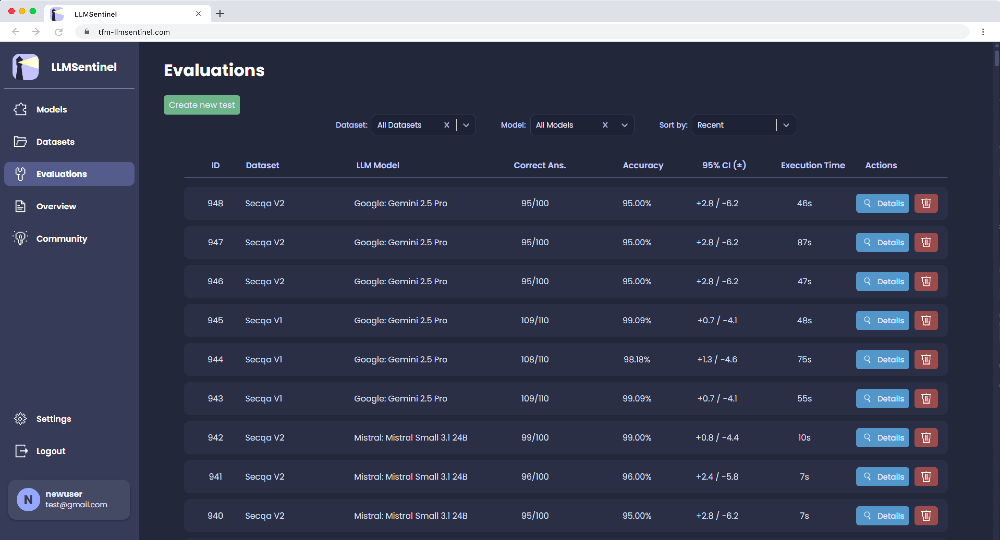
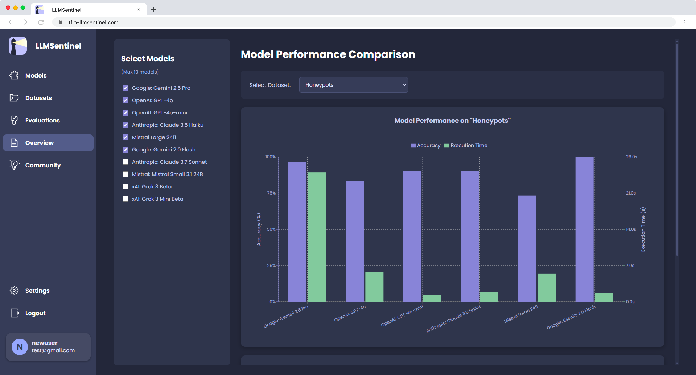

  

# LLMSentinel

**LLMSentinel** is a comprehensive web platform, developed as part of a Master's thesis project, for benchmarking Large Language Models (LLMs) on specific cybersecurity tasks. The platform enables researchers, students, and professionals to evaluate, compare, and analyze the performance of multiple LLMs from different providers in a unified and intuitive environment.

---

## ✨ Key Features
- **Unified access to multiple LLMs**: Integration with [OpenRouter](https://openrouter.ai/) to standardise communication with models from different providers (OpenAI, Anthropic, Google, Mistral, etc.)
- **Integrated Benchmarks:** Includes a suite of reference benchmarks like **SecQA**, **CSLU**, datasets from **CyberBench**, and a newly developed benchmark, **CyberDomain**, which covers 7 fundamental cybersecurity areas.
- **Automated evaluation**:
  - Multiple-choice question answering (MMLU style)
  - Metrics: Accuracy, Response time, Confidence intervals
- **Collaborative dataset management**: Import CSV datasets and share them with the community
- **Web interface**: Authentication, intuitive dashboards, comparative results with tables & charts

---

## 🛠️ Tech Stack
- **Frontend:** Typescript + React
- **Backend:** Python + Django
- **Database:** PostgreSQL  
- **LLM Communication:** OpenRouter API.

---

## 📸 Screenshots
See [Annex: Final UI](docs/annex_interface_final.md) for full screenshots of the platform.

  
  
  
  

## 🌐 Deployment

The **LLMSentinel** platform is live at:  
**https://frontend-rnow.onrender.com**

> Note: the first load may take a few seconds due to cold start on the hosting provider.