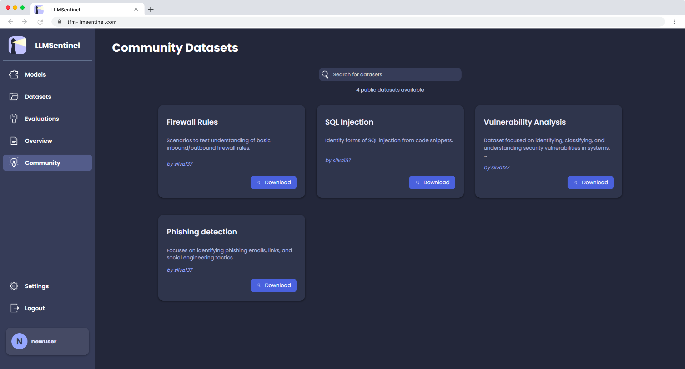
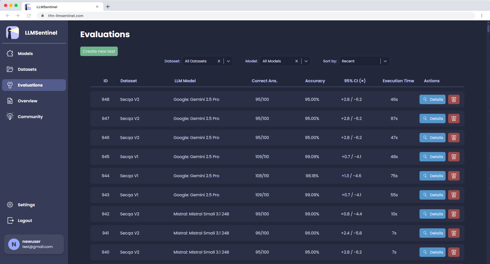
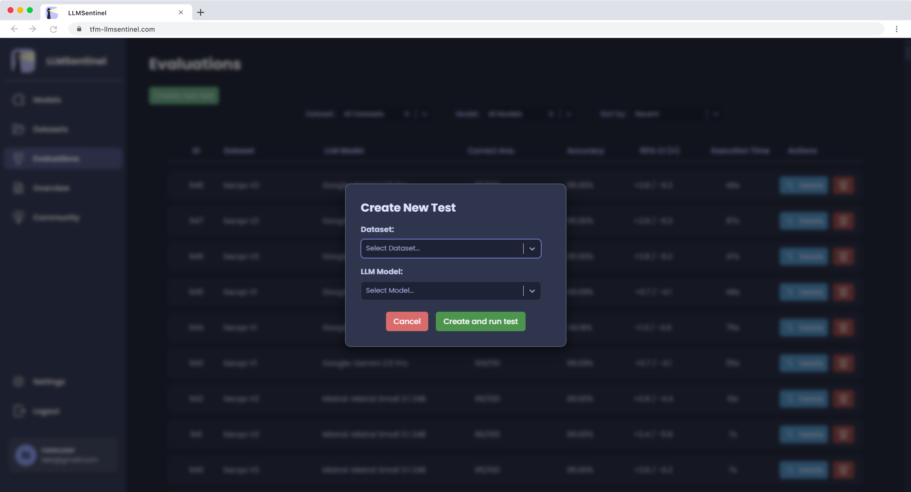
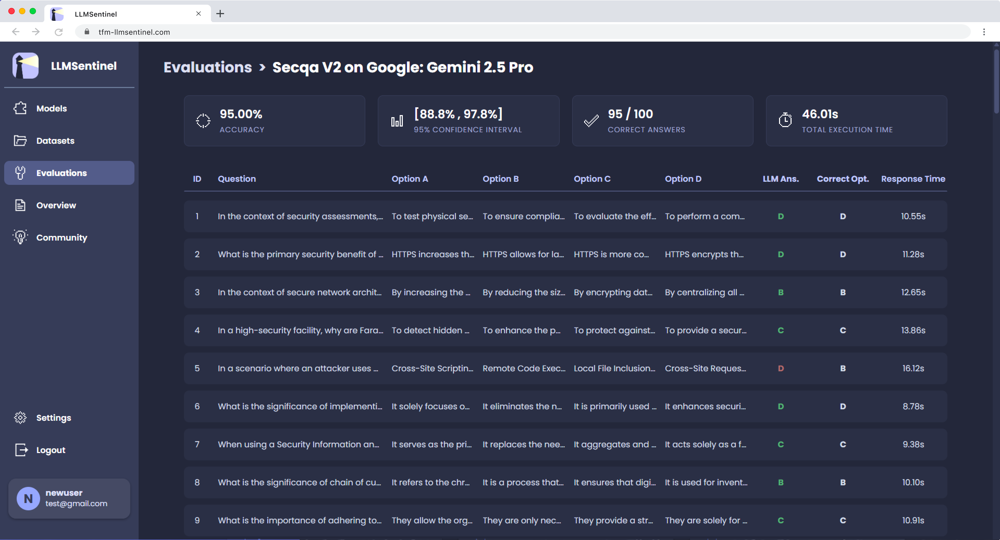

# Annex: Final UI (LLMSentinel)

Este anexo reúne um conjunto de capturas de ecrã que ilustram os principais ecrãs e funcionalidades da plataforma **LLMSentinel** na sua versão final (já publicada), servindo como uma representação visual do trabalho concluído.

---

## Índice
- [Página de autenticação (login)](#página-de-autenticação-login)
- [Página de registo de novos utilizadores](#página-de-registo-de-novos-utilizadores)
- [Pop-up: configuração de chave de API (OpenRouter)](#pop-up-configuração-de-chave-de-api-openrouter)
- [Página de modelos (listagem & pesquisa)](#página-de-modelos-listagem--pesquisa)
- [Página de datasets](#página-de-datasets)
- [Detalhe de um dataset](#detalhe-de-um-dataset)
- [Pop-up: importação de datasets (CSV)](#pop-up-importação-de-datasets-csv)
- [Página de datasets comunitários](#página-de-datasets-comunitários)
- [Página de avaliações executadas](#página-de-avaliações-executadas)
- [Pop-up: nova avaliação (seleção de dataset e modelo)](#pop-up-nova-avaliação-seleção-de-dataset-e-modelo)
- [Detalhes de uma avaliação](#detalhes-de-uma-avaliação)
- [Gráficos comparativos (Overview)](#gráficos-comparativos-overview)

---

## Página de autenticação (login)

  

---

## Página de registo de novos utilizadores

  

---

## Pop-up: configuração de chave de API (OpenRouter)

  

---

## Página de modelos (listagem & pesquisa)

  

---

## Página de datasets

  

---

## Detalhe de um dataset

  

---

## Pop-up: importação de datasets (CSV)

  

---

## Página de datasets comunitários

  

---

## Página de avaliações executadas

  

---

## Pop-up: nova avaliação (seleção de dataset e modelo)

  

---

## Detalhes de uma avaliação

  

---

## Gráficos comparativos (Overview)

  

---
