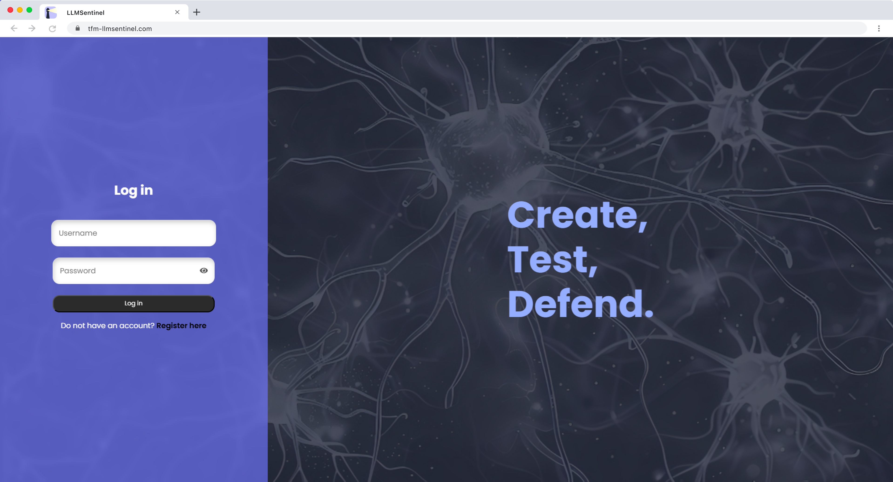
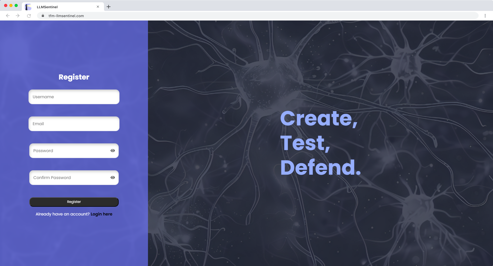
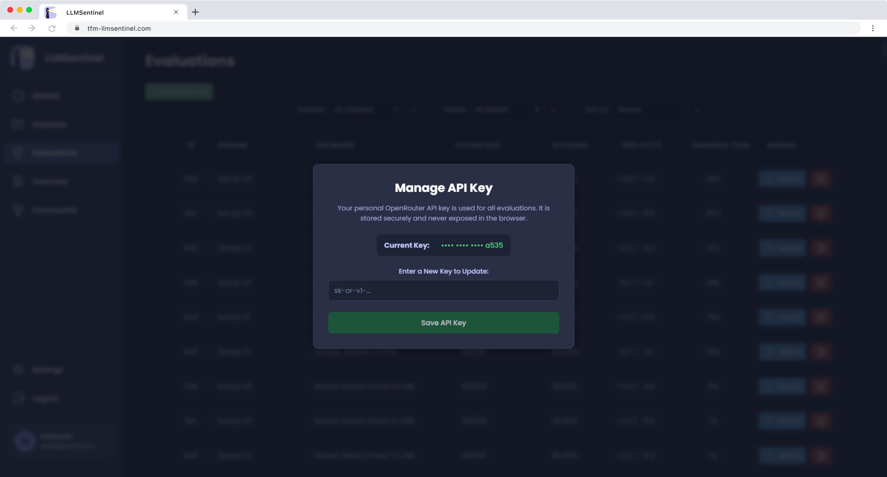
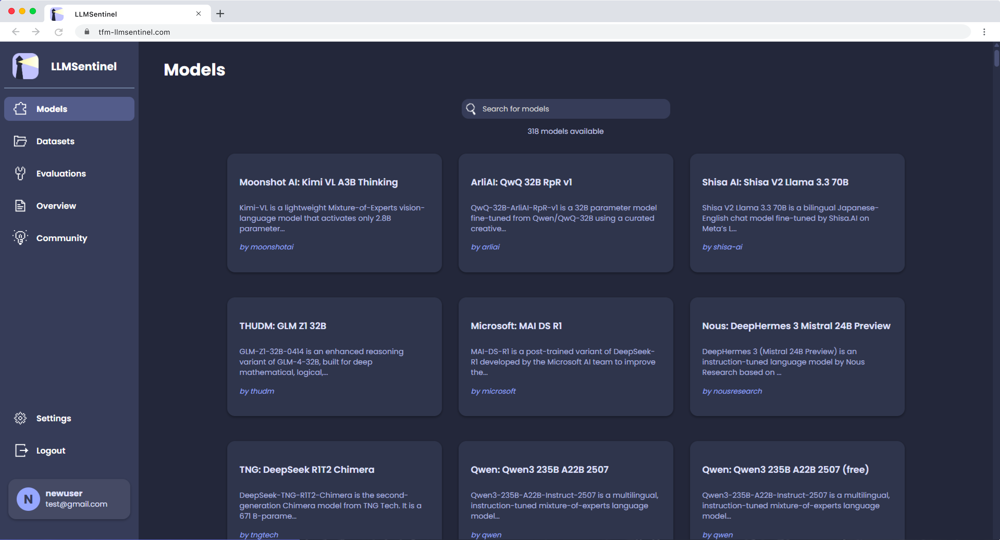
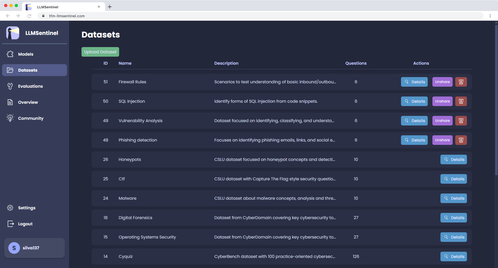
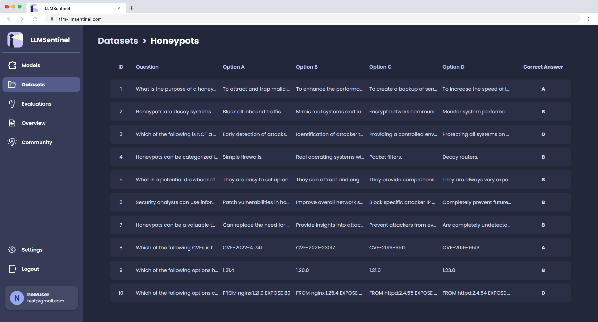
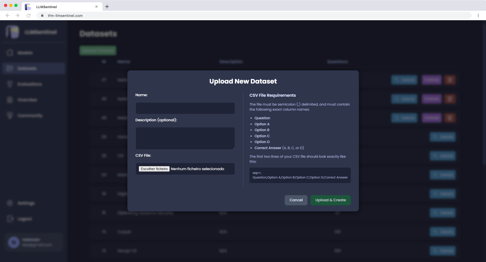

# Annex: Final UI (LLMSentinel)

This annex compiles a set of screenshots that illustrate the main screens and functionalities of the **LLMSentinel** platform in its final (published) version, serving as a visual representation of the completed work.

## Login page

  

---

## User registration page

  

---

## API key setup (OpenRouter) modal

  

---

## Models page (listing & search)

  

---

## Datasets page

  

---

## Dataset details

  

---

## Import datasets (CSV) modal

  
<
